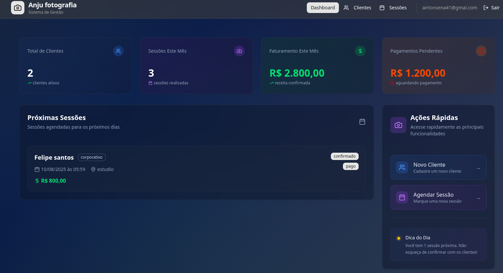
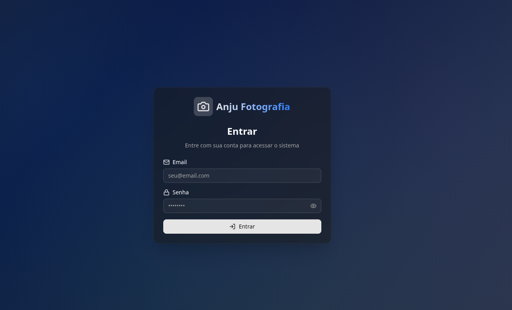

# 📸 anjo fotografia

Um sistema de gerenciamento completo para estúdios fotográficos, desenvolvido com Next.js 15, React 19, TypeScript e Firebase.

## Problema que o projeto resolve

Gerenciar clientes, sessões fotográficas e autenticação de usuários em um estúdio de fotografia pode ser complexo e sujeito a erros quando feito manualmente. A ausência de uma solução digital centralizada dificulta o acompanhamento de agendamentos, histórico de clientes e controle de acesso seguro.

## Solução proposta

O Photo Studio MVP é uma aplicação web desenvolvida com Next.js e Firebase, que permite:
- Cadastro e autenticação de usuários
- Gerenciamento de clientes
- Controle de sessões fotográficas
- Interface moderna e responsiva

## Funcionalidades

- **Gestão de Clientes** - Cadastro, busca e histórico de sessões
- **Agendamento de Sessões** - Múltiplos tipos (Newborn, Gestante, Casamento, etc.)
- **Dashboard Analítico** - Visão geral de clientes, sessões e receitas
- **Autenticação** - Sistema seguro com Firebase Auth

## � Interface

### Dashboard Principal

*Dashboard com visão geral de clientes, sessões, receitas e ações rápidas*

### Tela de Login

*Interface de autenticação com design moderno e responsivo*

## �🚀 Tecnologias Utilizadas

### Frontend
- **Next.js 15** - Framework React com App Router
- **React 19** - Biblioteca de interface
- **TypeScript** - Tipagem estática
- **Tailwind CSS** - Estilização utilitária
- **Radix UI** - Componentes acessíveis
- **Lucide React** - Ícones modernos
- **Sonner** - Notificações toast

### Backend & Database
- **Firebase** - Plataforma completa
  - **Firestore** - Banco de dados NoSQL
  - **Authentication** - Sistema de autenticação
  - **Security Rules** - Regras de segurança

### Desenvolvimento
- **ESLint** - Linting de código
- **PostCSS** - Processamento de CSS
- **Tailwind CSS** - Framework CSS


## 📁 Estrutura do Projeto

```
src/
├── app/                    # App Router do Next.js
│   ├── globals.css        # Estilos globais
│   ├── layout.tsx         # Layout principal
│   └── page.tsx           # Página inicial
├── components/            # Componentes React
│   ├── auth/             # Componentes de autenticação
│   ├── clients/          # Gestão de clientes
│   ├── dashboard/        # Dashboard e estatísticas
│   ├── sessions/         # Gestão de sessões
│   └── ui/               # Componentes de interface
├── hooks/                # React Hooks customizados
├── lib/                  # Utilitários e configurações
│   └── firebase/         # Configuração do Firebase
├── services/             # Serviços de API
├── types/                # Definições de tipos TypeScript
└── utils/                # Funções utilitárias
```

## 🎨 Interface

O sistema possui uma interface moderna e responsiva com:

- **Design System** baseado em Radix UI e Tailwind CSS
- **Componentes acessíveis** e semânticos
- **Layout responsivo** para desktop e mobile
- **Notificações** toast para feedback do usuário

## 🔒 Segurança

- **Autenticação obrigatória** para acesso às funcionalidades
- **Regras de segurança** no Firestore
- **Validação de dados** no frontend e backend
- **Rotas protegidas** com componente ProtectedRoute


## 🤝 Contribuição

1. Fork o projeto
2. Crie uma branch para sua feature (`git checkout -b feature/AmazingFeature`)
3. Commit suas mudanças (`git commit -m 'Add some AmazingFeature'`)
4. Push para a branch (`git push origin feature/AmazingFeature`)
5. Abra um Pull Request

## 📄 Licença

Este projeto está sob a licença MIT. Veja o arquivo [LICENSE](LICENSE) para detalhes.

## 📞 Suporte

Para suporte ou dúvidas, abra uma issue neste repositório ou entre em contato através do email de suporte.

---

Desenvolvido com ❤️ usando Next.js e Firebase
